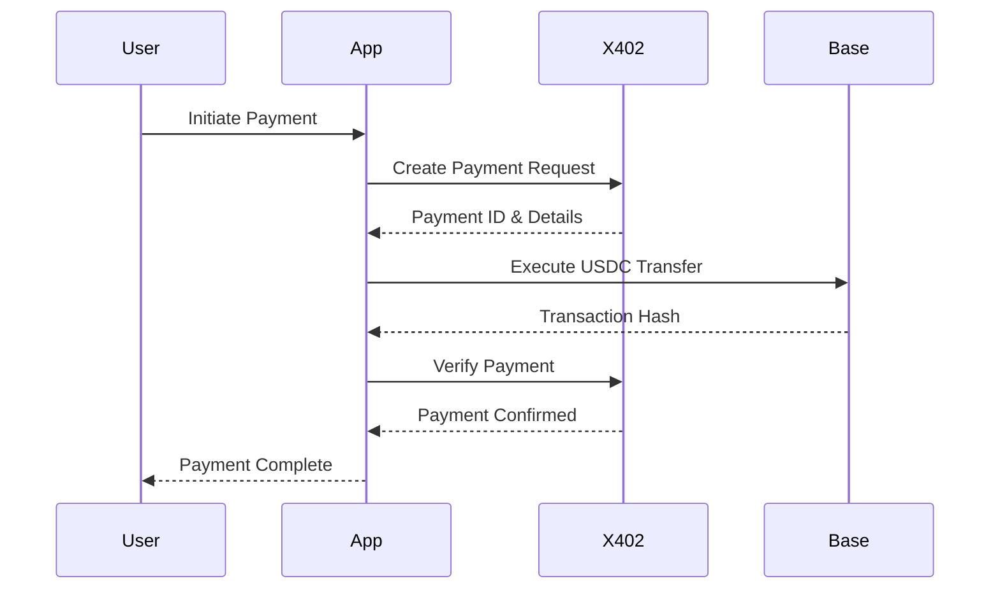

# 🌌 Nebula Arena - X402 Payment System

A modern, secure payment system built for Nebula Arena using the X402 protocol with USDC on Base network.

## ✨ Features

- **X402 Protocol Integration**: Seamless payment processing with X402 protocol
- **Base Network Support**: Fast and low-cost transactions on Base L2
- **USDC Payments**: Stable cryptocurrency payments using USDC
- **Wagmi + Viem**: Modern Web3 wallet integration
- **Real-time Tracking**: Live payment status and confirmation tracking
- **Error Handling**: Comprehensive error handling and user feedback
- **Responsive Design**: Mobile-first responsive UI with Tailwind CSS

## 🚀 Quick Start

### Prerequisites

- Node.js 18+ 
- npm or yarn
- A Web3 wallet (MetaMask, Coinbase Wallet, etc.)
- USDC on Base network for testing

### Installation

1. Clone the repository:
```bash
git clone <repository-url>
cd nebula-arena-x402-payments
```

2. Install dependencies:
```bash
npm install
# or
yarn install
```

3. Set up environment variables:
```bash
cp .env.example .env.local
```

Edit `.env.local` with your configuration:
```env
NEXT_PUBLIC_X402_BASE_URL=https://api.x402.example.com
NEXT_PUBLIC_X402_API_KEY=your-x402-api-key
NEXT_PUBLIC_WALLETCONNECT_PROJECT_ID=your-walletconnect-project-id
```

4. Run the development server:
```bash
npm run dev
# or
yarn dev
```

5. Open [http://localhost:3000](http://localhost:3000) in your browser.

## 🏗️ Architecture

### Core Components

- **X402Service**: Handles communication with X402 payment API
- **usePayment Hook**: React hook for payment operations and state management
- **WalletConnection**: Wallet connection and network management
- **PaymentForm**: Payment creation and validation
- **PaymentStatus**: Real-time payment status tracking

### Tech Stack

- **Frontend**: Next.js 14, React 18, TypeScript
- **Styling**: Tailwind CSS
- **Web3**: Wagmi, Viem
- **State Management**: TanStack Query (React Query)
- **HTTP Client**: Axios with X402 integration
- **Testing**: Jest, React Testing Library

## 🔧 Configuration

### Wagmi Configuration

The app is configured to work with Base network:

```typescript
// lib/wagmi.ts
export const config = createConfig({
  chains: [base, baseSepolia],
  connectors: [
    metaMask(),
    coinbaseWallet({ appName: 'Nebula Arena' }),
    walletConnect({ projectId: 'your-project-id' }),
  ],
  transports: {
    [base.id]: http(),
    [baseSepolia.id]: http(),
  },
})
```

### USDC Contract Addresses

```typescript
export const USDC_ADDRESSES = {
  [base.id]: '0x833589fCD6eDb6E08f4c7C32D4f71b54bdA02913', // Base Mainnet
  [baseSepolia.id]: '0x036CbD53842c5426634e7929541eC2318f3dCF7e', // Base Sepolia
}
```

## 📝 Usage

### Making a Payment

1. **Connect Wallet**: Click "Connect Wallet" and choose your preferred wallet
2. **Switch Network**: Ensure you're on Base network (the app will prompt if needed)
3. **Enter Payment Details**:
   - Amount in USDC
   - Recipient address
   - Optional description
4. **Send Payment**: Click "Send Payment" to initiate the transaction
5. **Track Status**: Monitor real-time payment status and confirmations

### Payment Flow



## 🧪 Testing

### Running Tests

```bash
# Run all tests
npm test

# Run tests in watch mode
npm run test:watch

# Run tests with coverage
npm test -- --coverage
```

### Test Coverage

The project maintains high test coverage for:
- X402 service integration
- Payment hook functionality
- Error handling scenarios
- Status mapping and validation

### Manual Testing Checklist

- [ ] Wallet connection (MetaMask, Coinbase Wallet, WalletConnect)
- [ ] Network switching (Base Mainnet/Sepolia)
- [ ] USDC balance display
- [ ] Payment form validation
- [ ] Payment execution
- [ ] Transaction confirmation tracking
- [ ] Error handling (insufficient balance, network errors, etc.)
- [ ] X402 service health monitoring

## 🔒 Security Considerations

### Best Practices Implemented

- **Input Validation**: All user inputs are validated client-side and server-side
- **Address Validation**: Ethereum addresses are validated using regex patterns
- **Amount Validation**: Payment amounts are checked against available balance
- **Error Handling**: Comprehensive error handling prevents information leakage
- **Network Verification**: Ensures transactions are on the correct network
- **Transaction Verification**: All payments are verified through X402 protocol

### Security Checklist

- [ ] Private keys never leave the user's wallet
- [ ] All API calls use HTTPS
- [ ] Input sanitization and validation
- [ ] Error messages don't expose sensitive information
- [ ] Transaction amounts are validated
- [ ] Network verification before transactions

## 🚀 Deployment

### Environment Variables

Required environment variables for production:

```env
NEXT_PUBLIC_X402_BASE_URL=https://api.x402.production.com
NEXT_PUBLIC_X402_API_KEY=your-production-api-key
NEXT_PUBLIC_WALLETCONNECT_PROJECT_ID=your-walletconnect-project-id
```

### Build and Deploy

```bash
# Build for production
npm run build

# Start production server
npm start
```

### Deployment Platforms

The app can be deployed to:
- Vercel (recommended for Next.js)
- Netlify
- AWS Amplify
- Docker containers

## 📊 Monitoring and Analytics

### Health Checks

The app includes built-in health monitoring:
- X402 service availability
- Network connectivity
- Wallet connection status

### Error Tracking

Implement error tracking with services like:
- Sentry
- LogRocket
- Bugsnag

## 🤝 Contributing

1. Fork the repository
2. Create a feature branch: `git checkout -b feature/amazing-feature`
3. Commit your changes: `git commit -m 'Add amazing feature'`
4. Push to the branch: `git push origin feature/amazing-feature`
5. Open a Pull Request

### Development Guidelines

- Follow TypeScript best practices
- Write tests for new features
- Use conventional commit messages
- Update documentation for API changes

## 📄 License

This project is licensed under the MIT License - see the [LICENSE](LICENSE) file for details.

## 🆘 Support

For support and questions:
- Create an issue in the repository
- Contact the development team
- Check the documentation

## 🔗 Links

- [Base Network](https://base.org)
- [USDC](https://www.centre.io/usdc)
- [Wagmi](https://wagmi.sh)
- [X402 Protocol Documentation](https://x402.example.com/docs)

---

Built with ❤️ for Nebula Arena • Powered by X402 Protocol
